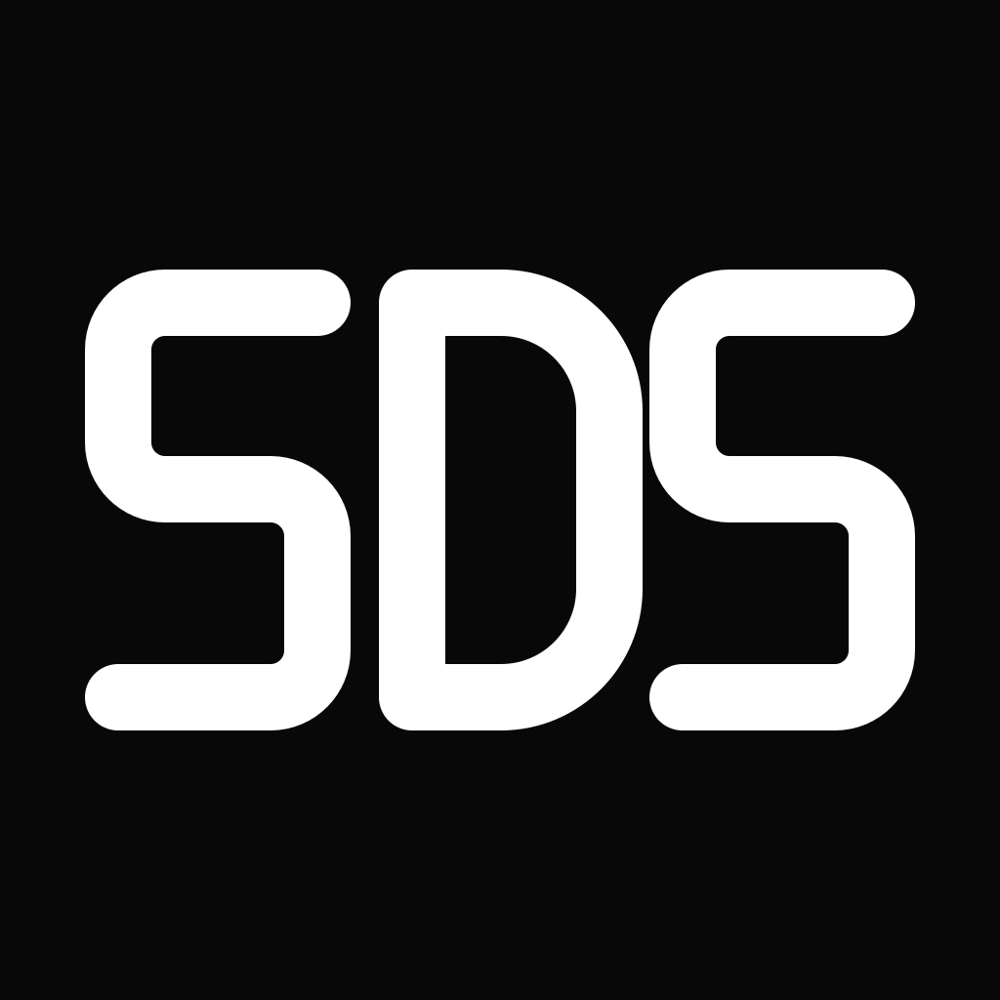
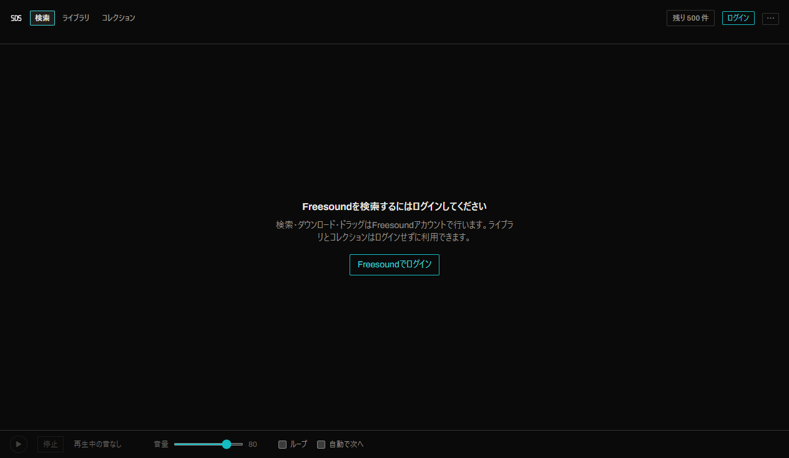
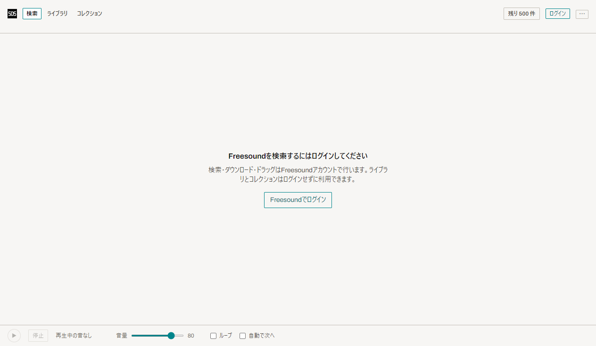

<p align="center"></p>

# SDS-Sound

日本語で使える、Freesound対応の無料デスクトップサンプルブラウザー。Windows向けインストーラーを配布し、コードは公開しています。[Super Duper Core](https://github.com/Super-Duper-Software/super-duper-core)（MIT）を基に開発した非公式フォークです。

<p>
  <a href="https://github.com/SakiikaVR/SDS-Sound/releases/latest"></a>
  <a href="LICENSE"></a>
</p>

[導入方法](INSTALL.md) · [接続設定](SETUP.md) · [ライセンス](THIRD_PARTY_NOTICES.md)

## 画面

以下は開発版を実際に起動して撮影したログイン前の画面です。検索結果や音声データの合成画像ではありません。

| ダークモード | ライトモード |
| --- | --- |
|  |  |

## 主な機能

| 機能 | 内容 |
| --- | --- |
| Freesound検索 | キーワード、タグ、ライセンス、長さなどで検索。ログインボタンからシステムブラウザーで認証します。 |
| BPM・キー | Freesoundの自動解析値で検索・絞り込み。値のない音源もあります。 |
| 類似音 | 選んだ音源を基に似た音を検索。 |
| 試聴・波形 | アプリ内で試聴。ライトモードの波形は水色です。 |
| ライブラリ | ダウンロードした音とローカル音声を管理。WAV、AIFF、FLAC、MP3、OGG、M4Aの取り込みに対応。 |
| コレクション | 音を整理して再利用。音声の編集、書き出し、DAWへのドラッグにも対応。 |
| 日本語 | アプリ画面とWindowsメニューを日本語化。設定から英語に切り替え可能。 |
| プライバシー | 広告・寄付ボタン・テレメトリーなし。複数端末同期なし。 |

## 動作環境と導入

Windows 10/11 x64。リリースページの `SDS-Sound-Setup-0.1.0.exe` をダウンロードして実行します。現時点でコード署名はありません。詳細は[INSTALL.md](INSTALL.md)を参照してください。macOS向けソースコードも含みますが、このリリースで配布・検証するのはWindows版です。

Freesound検索にはFreesoundアカウントと、SDS-Sound専用のAPI登録・OAuth Worker設定が必要です。配布用の認証情報が準備できるまで、公開版のログインは未提供です。ローカルライブラリはログインなしで使えます。[SETUP.md](SETUP.md)に設定手順があります。

## ソースからビルド

Node.js 24 と pnpm を用意します。`apps/desktop/.env.example` を `apps/desktop/.env` にコピーし、SDS-Sound専用のClient IDとWorker URLを設定します。Client Secretはデスクトップアプリに置かず、WorkerのSecretとして登録します。

```powershell
pnpm install --frozen-lockfile
pnpm --filter @superduper/desktop typecheck
pnpm --filter @superduper/desktop test
pnpm --filter @superduper/desktop pack:win
```

生成物は `apps/desktop/dist/` にできます。

## ライセンスと出典

アプリのソースコードは[MIT](LICENSE)です。元のSuper Duper Softwareの著作権表示を保持しています。Splicerrのコードは含めていません。フォント、Electron、同梱するFFmpegなどの第三者コンポーネントは個別のライセンスに従います。[THIRD_PARTY_NOTICES.md](THIRD_PARTY_NOTICES.md)を参照してください。Freesoundの各音声には個別のCreative Commonsライセンスがあり、ダウンロードした音源の利用条件を確認してください。

## 現在の制限

BPM・キーはFreesoundの自動解析値で、すべての音源に付いているわけではありません。Windowsインストーラーは未署名です。実アカウントでのOAuth、検索、ダウンロードはまだ未検証です。詳しくは[GAPS.ja.md](GAPS.ja.md)を参照してください。
